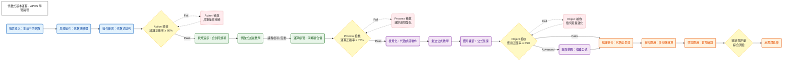

```mermaid
graph LR
    %% Title
    title[代數式基本運算 - APOS 學習路徑]

    %% Styles
    classDef default fill:#fff,stroke:#333,stroke-width:1px;
    classDef action fill:#e3f2fd,stroke:#1565c0,stroke-width:2px,color:#0d47a1;
    classDef process fill:#e8f5e9,stroke:#2e7d32,stroke-width:2px,color:#1b5e20;
    classDef object fill:#f3e5f5,stroke:#7b1fa2,stroke-width:2px,color:#4a148c;
    classDef schema fill:#fff3e0,stroke:#e65100,stroke-width:2px,color:#e65100;
    classDef checkpoint fill:#fff9c4,stroke:#fbc02d,stroke-width:2px,stroke-dasharray: 5 5;
    classDef remedial fill:#ffebee,stroke:#c62828,stroke-width:1px,stroke-dasharray: 3 3;

    %% Nodes - Stage Action (具體操作)
    action_intro(情境導入：生活中的代數)
    action_manipulate(具體操作：代數磚模擬)
    action_practice(操作練習：代數式排列)
    action_checkpoint{Action 檢核<br/>辨識正確率 ≥ 80%}
    action_remedial(Action 補救<br/>具象操作重練)

    %% Nodes - Stage Process (過程內化)
    process_intro(視覺演示：合併同類項)
    process_teaching(代數式加減教學)
    process_practice(運算練習：同類項合併)
    process_checkpoint{Process 檢核<br/>運算正確率 ≥ 75%}
    process_remedial(Process 補救<br/>運算過程強化)

    %% Nodes - Stage Object (物件封裝)
    object_intro(視覺化：代數式即物件)
    object_teaching(乘法公式教學)
    object_practice(應用練習：公式展開)
    object_checkpoint{Object 檢核<br/>應用正確率 ≥ 85%}
    object_remedial(Object 補救<br/>幾何意義強化)
    object_advanced(進階挑戰：複雜公式)

    %% Nodes - Stage Schema (基模整合)
    schema_intro(知識整合：代數全景圖)
    schema_integrate(綜合應用：多步驟運算)
    schema_practice(情境應用：實際解題)
    schema_assessment{總結性評量<br/>綜合測驗}
    schema_reflection(反思與延伸)

    %% Connections
    action_intro --> action_manipulate
    action_manipulate --> action_practice
    action_practice --> action_checkpoint
    
    action_checkpoint -->|Pass| process_intro
    action_checkpoint -.->|Fail| action_remedial
    action_remedial -.-> action_checkpoint

    process_intro --> process_teaching
    process_teaching -->|講義/影片/互動| process_practice
    process_practice --> process_checkpoint

    process_checkpoint -->|Pass| object_intro
    process_checkpoint -.->|Fail| process_remedial
    process_remedial -.-> process_checkpoint

    object_intro --> object_teaching
    object_teaching --> object_practice
    object_practice --> object_checkpoint

    object_checkpoint -->|Pass| schema_intro
    object_checkpoint -->|Advanced| object_advanced
    object_checkpoint -.->|Fail| object_remedial
    object_remedial -.-> object_checkpoint
    object_advanced --> schema_intro

    schema_intro --> schema_integrate
    schema_integrate --> schema_practice
    schema_practice --> schema_assessment
    schema_assessment --> schema_reflection

    %% Class Assignments
    class action_intro,action_manipulate,action_practice action;
    class process_intro,process_teaching,process_practice process;
    class object_intro,object_teaching,object_practice,object_advanced object;
    class schema_intro,schema_integrate,schema_practice,schema_reflection schema;
    
    class action_checkpoint,process_checkpoint,object_checkpoint,schema_assessment checkpoint;
    class action_remedial,process_remedial,object_remedial remedial;
```
